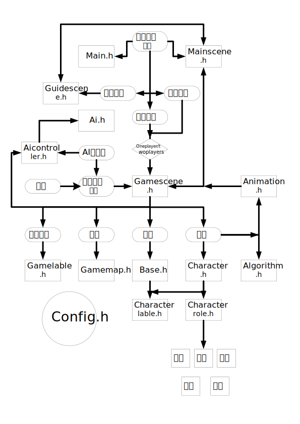

# 介绍

这一部分将会详细介绍代码的组成逻辑和一些比较重要的代码块。这会为你快速掌握该项目提供帮助。

# 目录说明
version3目录下存放着进行QT开发过程中的源代码，下面将介绍一下该目录的组成和一些文件的解释

* music
  该目录下存放着游戏过程中的配乐和攻击以及鼠标点击的效果音乐

* pic
  就是picture的意思，这里存放着游戏过程中的一些图片。
  里面的大部分素材取自英雄联盟，地图的制作为了方便起见，通过getMap.py来完成，当你修改地图时，请重新配置地图文件。

* .cpp与.h
  这些是相应的代码文件，其中值得注意的是config.h文件几乎是所有其他文件都必须包含的，这里面对游戏的所有参数进行了配置，放在config.h文件夹下也方便后续的修改。

* .qrc文件
  该文件是QT为方便大家引用图片或音乐等外部文件而设计的一个相对路径文件包含，通过把文件add入qrc中就可以在代码中运用了。

* .pro文件
  类似于我们之前学过的makefile文件，不过QT的pro文件更加简洁和方便。

# 整体框架



# 代码详解

* 地图问题
  注意gamemap.cpp代码中这一段的含义
  ```cpp
  for(int i=0; i<MAP_ROW; i++){
        for(int j=0; j<MAP_COL; j++){
            binMap[j][i] = MAP[i][j];
        }
    }
  ```
  这里相当于把MAP矩阵转置了一下，这是为了符合后面写代码的习惯，因为后面的鼠标等位置获取时，我们习惯得到x与y坐标，然而binMap[x][y] = MAP[y][x]，这也就是转置地图矩阵的原因。
  
  ```cpp
  const int MAP[MAP_ROW+1][MAP_COL+1] = {
    {0, 0, 0, 0, 0, 0,     0, 0, 0, 0, 0,  0, 0, 0, 0, 0,  0, 0, 0, 0, 0,  0, 0, 0, 0, 0},
    {0, 0, 0, 0, 0, 0,     0, 0, 0, 0, 0,  0, 0, 0, 0, 0,  0, 0, 0, 0, 0,  0, 0, 0, 0, 0},
    {0, 0, 1, 1, 1, 1,     1, 1, 2, 1, 1,  1, 2, 2, 2, 1,  1, 1, 1, 1, 1,  1, 1, 1, 1, 0},
    {0, 0, 1, 2, 1, 1,     1, 1, 2, 1, 1,  1, 2, 0, 2, 1,  1, 1, 1, 1, 1,  0, 0, 2, 0, 0},
    {0, 0, 1, 1, 1, 1,     1, 2, 2, 2, 1,  1, 2, 2, 2, 1,  1, 0, 1, 1, 1,  1, 1, 1, 1, 0},
    {0, 0, 1, 1, 1, 1,     1, 1, 2, 1, 1,  1, 1, 1, 1, 1,  0, 1, 1, 1, 1,  1, 1, 1, 1, 0},
    
    {0, 0, 1, 1, 1, 1,     1, 1, 1, 1, 1,  1, 1, 1, 1, 1,  1, 1, 1, 1, 1,  1, 1, 1, 1, 0},
    {0, 0, 1, 1, 1, 1,     1, 2, 2, 2, 1,  1, 3, 1, 0, 1,  1, 3, 3, 3, 1,  1, 1, 1, 1, 0},
    {0, 0, 2, 2, 2, 2,     1, 2, 3, 2, 1,  1, 1, 0, 1, 1,  1, 3, 2, 3, 1,  3, 3, 3, 3, 0},
    {0, 0, 1, 1, 1, 1,     1, 2, 2, 2, 1,  1, 0, 1, 2, 1,  1, 3, 3, 3, 1,  1, 1, 1, 1, 0},
    {0, 0, 1, 1, 1, 1,     1, 1, 1, 1, 1,  1, 1, 1, 1, 1,  1, 1, 1, 1, 1,  1, 1, 1, 1, 0},
    
    {0, 0, 1, 1, 1, 1,     1, 1, 1, 1, 0,  1, 1, 1, 1, 1,  1, 1, 3, 1, 1,  1, 1, 1, 1, 0},
    {0, 0, 1, 1, 1, 1,     1, 1, 1, 0, 1,  1, 3, 3, 3, 1,  1, 3, 3, 3, 1,  1, 1, 1, 1, 0},
    {0, 0, 0, 3, 0, 0,     1, 1, 1, 1, 1,  1, 3, 0, 3, 1,  1, 1, 3, 1, 1,  1, 1, 3, 1, 0},
    {0, 0, 1, 1, 1, 1,     1, 1, 1, 1, 1,  1, 3, 3, 3, 1,  1, 1, 3, 1, 1,  1, 1, 1, 1, 0},
    {0, 0, 0, 0, 0, 0,     0, 0, 0, 0, 0,  0, 0, 0, 0, 0,  0, 0, 0, 0, 0,  0, 0, 0, 0, 0}
    };
  ```

  需要小心的是，这里的地图会比我们实际想要构造的地图大上一圈，这是由于这么做的话，在后面针对地图使用DFS深度优先算法时，会比较方便。


* DFS深度优先算法
  本项目中的AI采用深度优先的方法来寻找接近敌人的路径或者攻击路径，并通过判断路径的长短来移动或攻击最接近的那个敌人。
  ```cpp
  // dfs寻找可行域
  void FindPathAlgorithm::findAvailableCell(const int x,const  int y, const int depth, Character* character[],const  int characterNum)
  {
      for (int i = 0; i < characterNum; i++)
          if (character[i] != m_nowCharacter && character[i]->m_characterState != Character::DEAD)
              if (character[i]->m_cellx == x && character[i]->m_celly == y) //遇见有人挡路绕不过去
                  return;

      if (depth > m_totalMove)return; // 行动点数耗尽
      if (m_resultMap[x][y] >= 0) //如果此点已经可行，则比较已知最短路和当前路哪个更短
      {
          m_resultMap[x][y] = min(depth, m_resultMap[x][y]);
      }
      else // 如果此点还没确定可行，则更新为可行
      {
          m_resultMap[x][y] = depth;
          m_availableCell.push_back(std::make_pair(x, y));
      }
      if (depth == m_totalMove)return;

      if (x - 1 >= 1 && GameMap::binMap[x - 1][y] != 0) // 向左走
      {
          if (GameMap::binMap[x - 1][y] == 2 || GameMap::binMap[x - 1][y] == 3) // 如果是水或者火，则行动力减少得更多
              findAvailableCell(x - 1, y, depth + 2, character, characterNum);
          else
              findAvailableCell(x - 1, y, depth + 1, character, characterNum);
      }
      if (x + 1 <= MAP_COL && GameMap::binMap[x + 1][y] != 0) // 向右走
      {
          if (GameMap::binMap[x - 1][y] == 2 || GameMap::binMap[x - 1][y] == 3) // 如果是水或者火，则行动力减少得更多
              findAvailableCell(x + 1, y, depth + 2, character, characterNum);
          else
              findAvailableCell(x + 1, y, depth + 1, character, characterNum);
      }
      if (y + 1 <= MAP_ROW && GameMap::binMap[x][y + 1] != 0) // 向下走
      {

          if (GameMap::binMap[x - 1][y] == 2 || GameMap::binMap[x - 1][y] == 3) // 如果是水或者火，则行动力减少得更多
              findAvailableCell(x, y + 1, depth + 2, character, characterNum);
          else
              findAvailableCell(x, y + 1, depth + 1, character, characterNum);
      }
      if (y - 1 >= 1 && GameMap::binMap[x][y - 1] != 0) // 向上走
      {
          if (GameMap::binMap[x - 1][y] == 2 || GameMap::binMap[x - 1][y] == 3) // 如果是水或者火，则行动力减少得更多
              findAvailableCell(x, y - 1, depth + 2, character, characterNum);
          else
              findAvailableCell(x, y - 1, depth + 1, character, characterNum);
      }
  }
  ```
  注意到：
  首先是迭代的返回逻辑，遇到别的角色堵住或者行动范围耗尽的话就会返回该函数，并且如果此时的路径可行的话，会比较哪一条路径的长度最短，来作为最终的结果。
  其次是这里对binMap内容的判断逻辑，遇到0即就是所谓的山脉无法行走遇到2或者3代表是地图上的水与火，则增加效果，会消耗更多的行动力。

* 信号与槽
  信号与槽的机制是QT的核心，用来进行对象之间的通信，为此QT引入了signals（信号）、slots（槽）、emit（发射），这些并不是C++的关键字，而是QT所特有的，会在QT相应的编译器中被转化为为标准的C++语句。
  * 首先创建一个信号，需要遵守QT的一些规则
  * 当需要调用外部函数，即对象之间需要沟通时，发送一个信号
  * 此时所有与该信号相关联的槽便会被调用，槽本身是一个函数，除此之外信号与槽的关联也需要程序员来完成
  * 信号与槽都定义在类中，需要有QObject及其派生类才可以使用
  ```cpp
  public slots:
    // 人物需要移动，连接到GameScene的寻路显示上
    void moveAction();
    // 人物需要攻击，连接到GameScene的攻击显示上
    void attrackAction();
    // 跳过选择，向GameScene说明有人结束
    void skipAction();
    // 被攻击时伤害结算，attrack是被攻击的攻击点数
    void attrackedEvent(const int attrack);
    // 需要更新数据时，发射数据更新信号
    void updateInfo()const ;
  signals:
      // 人物移动
      void characterMoveAction(Character*)const ;
      // 人物进攻
      void characterAttrackAction(Character*)const ;
      // 基本信息改变
      void infoChanged()const ;
      // 人物被攻击
      void beAttracked(int attrack)const ;
  ```
  比如在这里character.h中就定义了人物相关的槽和信号。
  其中，槽函数是需要在类中具体实现的，本质上就是一个函数，不过会由于信号来触发，相应的触发机制例如下图，通过emit来发射信号，通过connect来把信号与槽绑定
  ```cpp
  connect(MineBase, &Base::dieOneBase, this, &GameScene::dieOneBaseEvent);
  ```
  ```cpp
  void GameScene::dieOneBaseEvent(Base* deadBase){
    m_gameState = END;
    if(deadBase->m_belong == MINE)emit myLoss();
    else emit myWin();
    return;
    }
  ```
  其中connect可以自己加入一些代码，在执行槽函数之前会先执行connect里面的代码，槽函数的代码也可以自己定义，情况上比较类似于设计模式的观察者模式，不过使用信号与槽的机制会更加方便。

* 丰富的图形化游戏
  ```cpp
  // 被攻击时，attrack是被攻击的攻击点数
  void Character::attrackedEvent(const int attrack)
  {
      // 扣血
      m_hp -= int(m_armor/100.0 * attrack);

      // 判断是否死亡
      if (m_hp <= 0)
      {
          m_characterState = DEAD;
          hide();
          emit dieOneCharacter(this);
      }

      // 扣血条
      QLabel* tempLabel = new QLabel(parentWidget());
      tempLabel->setAttribute(Qt::WA_DeleteOnClose);
      if(attrack>0){
          tempLabel->setStyleSheet("color:rgb(117, 27, 19); font:bold; font-size:20px;");
          tempLabel->setText(QString("-%1").arg(attrack));
      }
      else{
          tempLabel->setStyleSheet("color:rgb(36, 169, 255); font:bold; font-size:20px;");
          tempLabel->setText(QString("+%1").arg(-attrack));
      }
      
      tempLabel->show();
      tempLabel->raise();
      // 扣血条上浮并停留的动画
      QPropertyAnimation* animation = new QPropertyAnimation(tempLabel, "geometry");
      animation->setDuration(1000);
      animation->setStartValue(QRect((m_cellx - 1) * CELL_SIZE + CELL_SIZE / 4, (m_celly - 1) * CELL_SIZE - 30, tempLabel->width(), tempLabel->height()));
      animation->setEndValue(QRect((m_cellx - 1) * CELL_SIZE + CELL_SIZE / 4, (m_celly - 1) * CELL_SIZE - 30 - 30, tempLabel->width(), tempLabel->height()));
      animation->start();

      emit infoChanged();
      QTimer::singleShot(1500, this, [=]() {tempLabel->close(); });
  }
  ```
  就例如上述代码，作为角色被攻击时触发的槽函数。不仅更新了角色的血量和状态，而且还在图形化界面中加入了扣血或加血的动画，分析代码我们也可以得知，QT中的图形化界面的实现在这一部分比较类似于贴图，设计矩形框和内容并放到屏幕上show与close
  ```cpp
  // 画右上角回合提示
    if (m_roundBelonged == MINE)
        painter.setBrush(QBrush(QColor(36, 169, 255)));
    else painter.setBrush(QBrush(QColor(117, 27, 19)));
    painter.drawRect((MAP_COL-4)*CELL_SIZE, 0, CELL_SIZE, CELL_SIZE);
    painter.setBrush(Qt::white);
    painter.drawRect((MAP_COL-3)*CELL_SIZE, 0, CELL_SIZE*3, CELL_SIZE);
    painter.setBrush(Qt::NoBrush);
    
    if (m_roundBelonged == MINE)
        painter.setPen(QColor(36, 169, 255));
    else painter.setPen(QColor(117, 27, 19));
    QFont font("宋体", 16, 40, false);
    font.setPixelSize(CELL_SIZE*1);
    painter.setFont(font);
    painter.drawText((MAP_COL-3)*CELL_SIZE+16, CELL_SIZE-10, QString("%1&%2").arg(m_game_number/2+1).arg(m_aliveNum[m_roundBelonged]));
    painter.setPen(Qt::NoPen);

    // 当前地块用方框标白
    painter.setPen(QPen(Qt::white, 4));
    if(m_map.binMap[m_mouseCellx][m_mouseCelly] != 0){
    painter.drawRect((m_mouseCellx - 1) * CELL_SIZE,
        (m_mouseCelly - 1) * CELL_SIZE,
        CELL_SIZE, CELL_SIZE);
    }
    painter.setPen(Qt::NoPen);
  ```
  在这里则是通过画笔和刷子来实现绘图功能，比较的灵活。